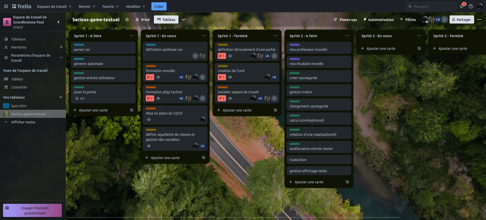
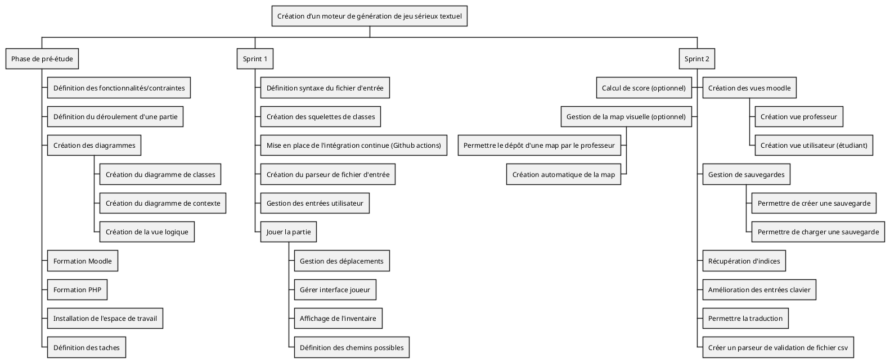
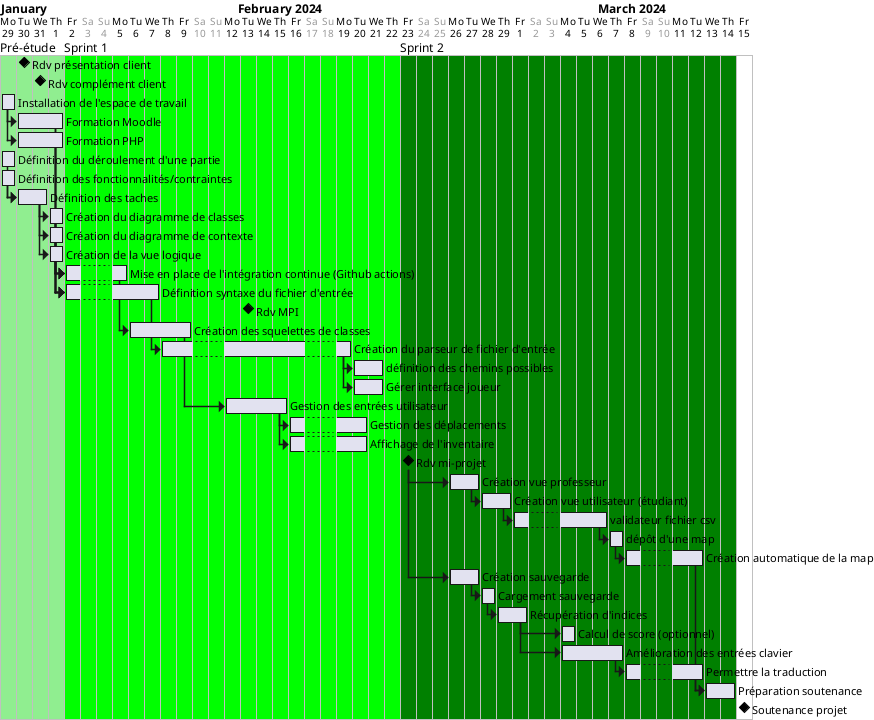

# Création d’un moteur de génération de jeu sérieux textuel

## Cahier des charges

### Contexte et enjeux
- <b>environnement</b> : moodle, IFPS
- <b>client</b> : Lionel DI MARCO (Département de Maïeutique des UFR de Médecine et CHU Grenoble Alpes)
- <b>parties prenantes</b> : client (Lionel DI MARCO), professeurs encadrants (Didier DONZEZ, Emmanuelle TREHOUST)
- <b>problème à résoudre</b> : rendre l'apprentissage des pratiques protocolaires plus facile et ludique pour les étudiants en maïeutique
- <b>enjeux pour le client</b> : veut permettre aux utilisateurs (étudiants) d'appendre plus facilement des pratiques médicales tout en jouant à un jeu. Permettre à des professeurs de créer des sérious game adapter a leurs cours.
### Objectifs :
- <b>livrables attendus</b> : 
    - plug-in moodle fonctionnel avec dépôt d'un fichier csv conforme par le professeur et possibilité pour les étudiants d'y jouer. Le jeu se déroulera seulement textuellement : les étudiants devront répondre en écrivant dans la console prévue pour avancer dans leur histoire. L'histoire est composée du joueur avec son inventaire, des lieux liés entre eux et potentiellement avec des personnages et des objets. Les personnages ont des états et potentiellement des objets. Chaque lieu peut être fermé et requiert un objet pour le dévérouiller.
    - possibilité de sauvegarder, récupérer des indices, calcul de score, création/dépôt de map, traductions
- <b>Product Breakdown Structure</b> : 
- <b>Hiérarchie des objectifs</b> : Commencer par le 1er livrable attendu puis le 2ème. Dans le 2ème, le calcul du score, la map sont optionnels.
### Processus de validation :
- les critères sont la validation des éléments des livrables

## Organisation du projet :

### Démarche et planning

- <b>Work Breakdown Structure</b> :

- <b>Gantt</b> :

### Resources
- <b>Equipement:</b> 
    - Ordinateur personnel
- <b>Budget prévisionnel</b> 
    - **Salaire moyen par ingénieur:** 60 000 euros par an (estimation), 230 euros par jour
    - **Nombre de jours ouvrables:** 32 jours
    - **Nombre total de jours de travail pour 4 ingénieurs:** 128 jours
    - **Coût par jour pour 4 ingénieurs:**  920 euros
    - **Coût total estimé pour les ingénieurs sur toute la durée du projet:** 29440 euros

- <b>Ressources humaines</b>  
### Organisation et communication
- <b>Equipe projet:</b> 
    - Paul GRANDHOMME, chef de projet, responsable de la planification et de la mise en oeuvre du projet, gestion de la communication avec le client. 
    - Loric GALLIER, scrum master, responsable de la gestion des sprints.
    - Benjamin BRAQUIER, développeur
    - Mathis Courant, développeur 
- <b>Règles de communication:</b> Daily réunion au début de chaque journée pour parler de ce qui à été fait la veille et des objectifs de la journée avec tous les membres de l'équipe. Reporting du travail réalisé par les différents membres de l'équipe par le biais d'un journal de bord à remplir tous les jours.
- <b>Equipe étendue :</b> Didier DONZEZ, Emmanuelle TREHOUST
- <b>Comité de pilotage :</b>
- <b>principes de communication avec le maître d’ouvrage : </b> Réunion prévu a mis projet, démonstration d'une première version prototype a ce moment la. 

### Risques

- **Forces :** 
  - Le besoin du client est clair et défini, offrant une base solide pour le projet.
  - Le projet bénéficie du soutien des parties prenantes, y compris du client et des professeurs encadrants.

- **Faiblesses :** 
  - Dépendance aux ressources humaines : L'équipe est composée de seulement quatre personnes, ce qui pourrait limiter sa capacité à faire face à d'éventuels défis ou imprévus.
  - Contraintes de temps : Le projet doit respecter un délai défini, ce qui peut exercer une pression supplémentaire sur l'équipe pour respecter les échéances.
  - découverte du développement d'une extension moodle et du php 

- **Opportunités :** 

  - Expansion vers d'autres domaines : Une fois développé et testé dans le domaine de la maïeutique, le moteur pourrait être adapté et étendu à d'autres domaines éducatifs ou de formation professionnelle via la création de nouveaux scénario.

- **Menaces :** 
  - Contraintes vis a vis de moodle : le module doit être valider par moodle pour pouvoir être mis en place
  - Contraintes techniques : Les défis techniques liés à la mise en œuvre du moteur de jeu pourraient entraîner des retards ou des difficultés imprévues dans le développement du projet.

### Indicateurs pilotage
 ### Indicateurs de mesure et de contrôle du projet

1. **Avancement du projet :**
   - Nombre de fonctionnalités implémentées par rapport au plan initial.
   - Pourcentage de tâches terminées par rapport au planning prévu.
   - Respect des jalons et des échéances définis dans le planning.

2. **Qualité des livrables :**
   - Nombre de bugs ou de problèmes de qualité détectés et corrigés.
   - Niveau de satisfaction des utilisateurs ou des parties prenantes après chaque livraison.
   - Respect des normes de développement et des bonnes pratiques.

3. **Satisfaction du maître d'ouvrage :**
   - Feedback du maître d'ouvrage lors des revues de sprint ou des réunions de suivi.
   - Respect des spécifications et des exigences définies dans le cahier des charges.
   - Taux de satisfaction globale exprimé par le maître d'ouvrage tout au long du projet.

4. **Motivation de l'équipe :**
   - Feedback des membres de l'équipe lors des réunions quotidiennes ou des rétrospectives.
   - Taux d'absentéisme ou de rotation de l'équipe.
   - Participation active des membres de l'équipe aux différentes phases du projet.
