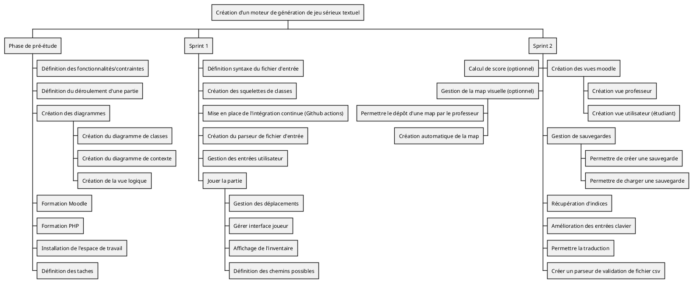
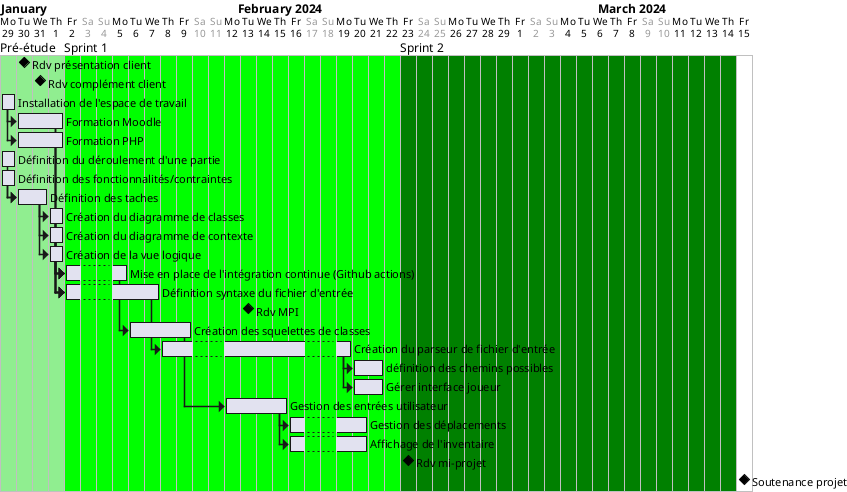

# Création d’un moteur de génération de jeu sérieux textuel

## Cahier des charges

### Contexte et enjeux
- <b>environnement</b> : moodle, IFPS
- <b>client</b> : Lionel DI MARCO (Département de Maïeutique des UFR de Médecine et CHU Grenoble Alpes)
- <b>parties prenantes</b> : client (Lionel DI MARCO), professeurs encadrants (Didier DONZEZ, Emmanuelle TREHOUST)
- <b>problème à résoudre</b> : rendre l'apprentissage des pratiques protocolaires plus facile et ludique pour les étudiants en maïeutique
- <b>enjeux pour le client</b> : veut permettre aux utilisateurs (étudiants) d'appendre plus facilement des pratiques médicales tout en jouant à un jeu
### Objectifs :
- <b>livrables attendus</b> : 
    - plug-in moodle fonctionnel avec dépôt d'un fichier csv conforme par le professeur et possibilité pour les étudiants d'y jouer. Le jeu se déroulera seulement textuellement : les étudiants devront répondre en écrivant dans la console prévue pour avancer dans leur histoire. L'histoire est composée du joueur avec son inventaire, des lieux liés entre eux et potentiellement avec des personnages et des objets. Les personnages ont des états et potentiellement des objets. Chaque lieu peut être fermé et requiert un objet pour le dévérouiller.
    - possibilité de sauvegarder, récupérer des indices, calcul de score, création/dépôt de map, traductions
- <b>Product Breakdown Structure</b> : 
- <b>Hiérarchie des objectifs</b> : Commencer par le 1er livrable attendu puis le 2ème. Dans le 2ème, le calcul du score, la map sont optionnels.
### Processus de validation :
- les critères sont la validation des éléments des livrables

## Organisation du projet :

### Démarche et planning

- <b>Work Breakdown Structure</b> :

- <b>Gantt</b> :

### Resources
### Organisation et communication
### Risques
### Indicateurs pilotage