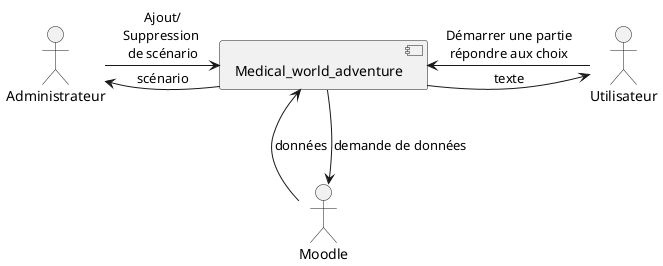
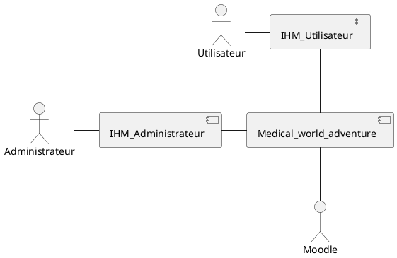
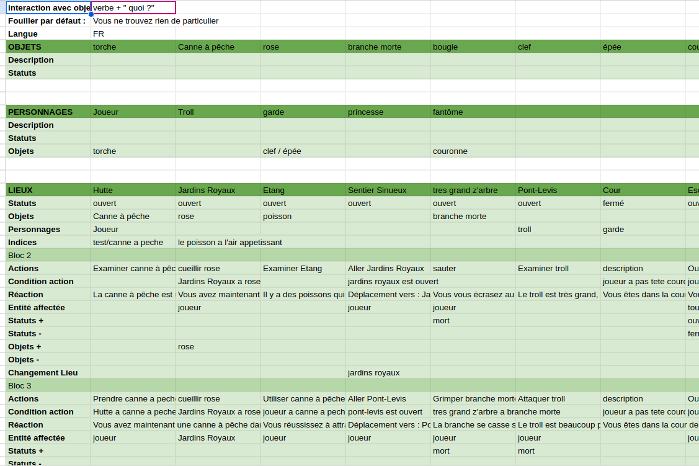
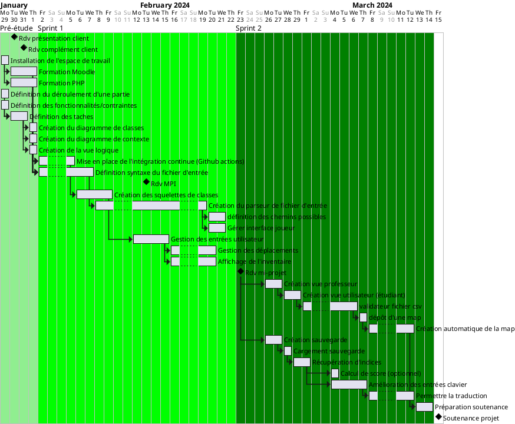
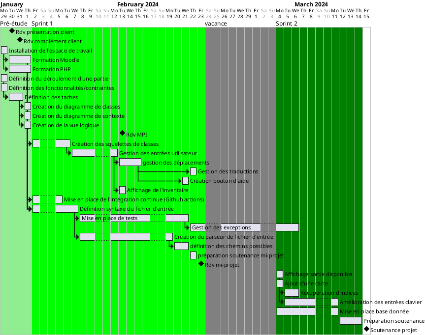
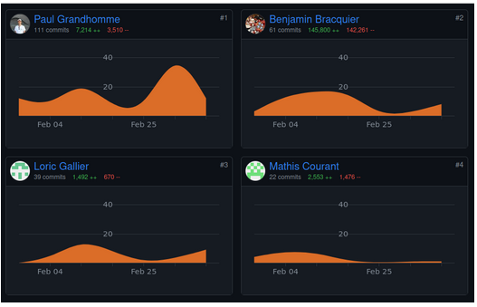
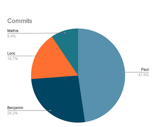

# Rapport Final

## Rappel du sujet/besoin et cahier des charges
La crise sanitaire de la Covid-19 a montré la nécessité de trouver de nouveaux moyens d’enseignement. En effet, dû à la digitalisation des enseignements certaines pratiques d’enseignements ont dû évoluer afin de capter l’attention des étudiants. L’apparition d'applications comme Wooclap ou Kahoot ou l’utilisation de Discord en sont de bon exemples.
Dans le cadre grenoblois de la maïeutique, l’usage des jeux sérieux est assez courant. La formation des futures sages-femmes étant une formation dont la part d’enseignement pratique et de mise en pratique est importante. 

Les jeux sérieux (ici, jeu de rôles fiction, mais aussi jeux de rôles réalistes, jeux de plateau ou de cartes) permettent de pouvoir les faire travailler sur un abord procédural décontextualisé et engageant.
Ainsi un concept de jeu sérieux a été utilisé par un enseignant du département sur le modèle du jeu « Colossal Cave Adventure », jeu vidéo d’aventure historique sur PC (https://fr.wikipedia.org/wiki/Colossal_Cave_Adventure).

 Deux scénarios ont été créés afin d’être joués en direct sur Discord par des groupes d’une dizaine d’étudiants au tour par tour. L’enseignant réagissait aux actions proposées par les étudiants en suivant les logigrammes de réponses-actions préalablement créées à partir de deux scénarios initiaux.

Ce jeu intègre des lieux (exemple : Infirmerie), des objets (exemple : Ordinateur) et des actions (exemple : Allumer Ordinateur) qui permettent de suivre une ligne scénaristique prédéfinie. Chaque entrée du joueur doit correspondre à un verbe d’action à l’infinitif, associé ou non à un complément (exemples : sauvegarder partie / utiliser seringue sur patient / Lire dossier / fouiller pièce…).

L’objectif est donc de développer un moteur de jeu pour répondre aux deux spécifications fonctionnelles suivantes:
- (1) lancer un scénario proposé par l’utilisateur-enseignant et 
- (2) permettre une utilisation du jeu par l’utilisateur-apprenant en autonomie complète.

Le moteur de jeu prendra la forme d’une extension Moodle à laquelle le professeur pourra fournir un scénario sous la forme d’un fichier csv, répondant à un modèle prédéfini.
Le cahier des charges technique doit envisager :

    Mécaniques du jeu :
       ◦ Moteur génératif, l’application devra permettre de :
            - lancer un scénario à partir d’un fichier csv (ou template d’un autre format à définir) ; 
            - mais aussi de jouer les parties implémentées via le template
       ◦ La partie Motrice de l’application devra être simple et ne nécessiter qu’un upload du template
       ◦ Le template devra correspondre à un standard bien précis avec :
           ▪ Situation de départ
           ▪ Situation de résolution
           ▪ Condition(s) de résolution (fin de partie réussie)
           ▪ Condition(s) d’échec critique (fin de partie)
           ▪ Objets d’interaction (matériel, personnage, lieu)
           ▪ Gestion d’inventaire (apparition / retrait d’objet)
           ▪ Déplacements possibles
           ▪ Actions autorisées (sous forme de liste fournie ou non)
           ▪ Proposition d’indices d’aide
           ▪ Sauvegarde de partie
           ▪ Reprise de partie à la sauvegarde (en cas d’échec)
        ◦ La partie Générative de l’application proposera un jeu d’aventure textuel (pas d’affichage autre que du texte, et pas d’implémentation d’actions autres que du texte)
        ◦ Il peut être envisagé (facultatif) un calcul de score de réussite en fonction de l’atteinte d’objectifs, du nombre de sauvegarde, le nombre d’indices utilisés et du nombre de reprise du scénario après échec
    Langage de programmation
       ◦ Il est laissé à l’appréciation des étudiants ou de l’encadrement de Polytech
Aucune spécificité n’est demandée concernant :

       ◦ Les graphismes : aucun n’est prévu
       ◦ Le mode multijoueur : un seul Personnage-Joueur est joué. Il peut l’être en même temps par plusieurs joueurs devant leur écran, qui discutent de la meilleure marche à suivre
       ◦ Les sons ou la musique : aucun n’est prévu
       ◦ L’IA : la ligne scénaristique est écrite et ne nécessite aucun ajustement

## Technologies employées

Le but de notre projet est de créer une extension de Moodle. Cette technologie, développée en PHP, permet à des enseignants de créer des cours pour leurs élèves. 

Ces cours peuvent être constitués d’activités. La création d’une activité représente d’ailleurs l’objectif de notre projet. Moodle est également un projet open-source permettant à tout le monde de partager de nouvelles extensions avec la communauté. 

Ces extensions peuvent concerner des activités, des modules de cours, des systèmes d'authentification ou encore des thèmes. Pour ce faire, il est possible de télécharger une version locale du site et y développer ces extensions. Ceci est ce que nous avons fait pour créer une nouvelle activité en PHP. 

Pour ce projet, nous avons développé en utilisant la programmation objet de ce langage.

## Architecture techniques

Notre application prend la forme d’un plugin Moodle, l’enseignant crée une activité Moodle en utilisant le plugin dans lequel il peut déposer un fichier au format csv contenant le scénario, suite à ça les étudiants peuvent réaliser l’activité et jouer au jeu sérieux.

Nous avons donc trois utilisateurs différents qui peuvent interagir avec notre application, le professeur avec un rôle d’administrateur, les étudiants avec un rôle de simple utilisateur et Moodle qui nous sert de base de données.
L’administrateur à la possibilité de gérer le scénario, de le modifier, d’en ajouter un, de le supprimer. L’étudiant peut quant à lui lancer une partie et suivre son déroulé jusqu'à la victoire en envoyant des commandes textuelles.

Pour ce qui est de l’architecture nous avons deux IHM différentes, une pour l’Utilisateur et une pour l’Administrateur qui communique avec l’application principale. L’application principale est décomposée en deux parties, une qui s’occupe du parsing du csv et une de la gestion d’une partie et des actions effectuées par l’Utilisateur.

## Réalisations techniques

### Modèle de données

Étant donné que nous devions commencer le projet à partir de zéro, nous avons dû créer un modèle de données représentatif de notre jeu. Nous avons remarqué qu’en créant les différentes tables, certaines se ressemblaient. Cela est notamment le cas pour les tables Location, Character et Item. Nous avons donc créé une table parent Entity. Même chose pour les conditions : Condition est la table parente de Leaf_Condition et Node_Condition.

Lors de l’étape de parsing (détaillée dans la section suivante), les tables sont remplies/ Pendant l’exécution du jeu en lui-même, aucun enregistrement n’est ajouté ou supprimé : le programme se contente de modifier la valeur des attributs au cours de la partie.

### Parsing
Après notre première réunion avec Lionel Di Marco, nous avons décidé que la définition d’un scénario se ferait à l’aide d’un fichier CSV. Dans ce fichier, il est possible de créer des objets, des personnages et des lieux. Pour faire évoluer la partie, le créateur du scénario peut attribuer des actions à chaque lieu. Une action n’exécute que si sa condition correspondante est vérifiée. Si tel est le cas, une zone “réactions” du CSV permet par exemple de déplacer les objets entre les personnages ou bien de déplacer les personnages entre les lieux.

L’initialisation du jeu consiste donc à parser ce fichier. Dans un premier temps, notre algorithme crée les objets, personnages et lieux en leur attribuant également certaines propriétés indiquées dans le CSV. Une fois ceci réalisé, nous avons pu attribuer les actions, conditions et réactions aux lieux.

Les conditions ont été les plus complexes à traiter. En effet, nous avons dû créer une syntaxe que le créateur de scénario doit respecter. Ces conditions peuvent être constituées de plusieurs sous-conditions en utilisant les opérateurs logiques “et” et “ou” ainsi que des priorités d’opération avec des parenthèses. Le parsing d’une condition consiste alors à construire un arbre binaire ayant pour feuilles les sous-conditions et pour nœud les opérateurs logiques. Pour ce faire, nous avons utilisé l’algorithme de Shunting Yard.

### Base de données
Notre base de données (BDD) est tirée de notre modèle de données. Chaque classe du modèle de données se retrouve dans une table de la BDD. Si une classe a une classe parent, alors on retrouvera un champ dans la table BDD associée avec l’id de l’objet parent. Dans le cas où il y a des champs sous forme de tableau de valeurs, nous avons créé une nouvelle table pour faire le lien entre chaque valeur et sa classe.

Nous avons pu mettre en place notre BDD grâce à un fichier XMLDB au format XML. Ce fichier XMLDB est un format spécial pour les BDD de Moodle permettant de créer des tables, leurs champs et donner les propriétés de ces champs à la manière des langages sql. Lorsque notre plugin est installé, le fichier XMLDB est lu par Moodle et crée la BDD automatiquement.

L’accès à la BDD se fait grâce aux méthodes prédéfinies de l’API Moodle.

### Synonymes
Afin d’améliorer l’expérience utilisateur et de faciliter la navigation du joueur dans le scénario nous avons implémenté une fonction nous permettant de vérifier si il utilise un synonyme du mot d’action recherché. 

Ainsi si l’utilisateur utilise “ramasser” au lieu de “prendre”, après avoir vérifié que le mots ne correspond à aucune action prédéfinis, on va récupérer la liste des synonyme du verbe d’action “ramasser”, et vérifier si l’un de ces synonymes correspond à une action possible. 

En l'occurrence “prendre” étant un synonyme on reconnaît cette action comme étant l’action que l’utilisateur cherche à effectuer, va donc procéder à la suite du programme et regarder si cette action est réalisable.
Nous avons implémenté la détection de synonymes pour des mots en anglais et en français. 

## Gestion de projet (méthode, planning prévisionnel et effectif, gestion des risques, rôles des membres ...)

Pour notre projet, nous avons opté pour une gestion de projet agile. La durée du projet étant relativement courte, il était important pour nous d’avoir une bonne communication entre les différents membres du groupe et de pouvoir nous adapter rapidement. Que ce soit en cas de nouveaux besoins du client ou, étant donné que nous travaillons avec de nouvelles technologies pour nous, de la nécessité de faire marche arrière et de trouver une nouvelle solution. 

Cela nous a également permis de rester motivés tout au long du projet, grâce à la livraison d’itération régulière, qui en plus de nous donner une plus grande flexibilité et réactivité, nous a permis d’observer une réelle progression du projet.

Nous équipe de projet était composé de 4 membres, chacun avec un rôle :
- Paul Grandhomme : chef de Projet/ développeur
- Loric Gallier : scrum master/ développeur
- Benjamin Braquier : développeur
- Mathis Courant : développeur

Nous avons réparti notre planning en deux sprints de trois semaines environ et un sprint de  pré-études d’une semaine.
La semaine de pré-étude a eu pour objectif de :
    
    - nous familiariser avec le sujet 
    - nous familiariser avec les technologies utilisées (Moodle, PHP)
    - définir architecture de l'application
    - définir le format du scénario
    - définir les différentes tâches à réaliser
Le premier sprint est quant à lui axé sur la mise en places de l’application et de toutes ses fonctionnalités de base avec deux grand axes :

    - la gestion du parseur pour le csv et l’initialisation d’une partie
    - la gestion de la partie en elle-même et de son déroulement
A la fin de ce sprint, l’objectif que nous souhaitions atteindre était d’obtenir un plugin avec toutes les fonctionnalités de base demandées utilisable.

Le dernier sprint consiste en des améliorations ajoutées au plugin afin de rendre l'interaction avec l’utilisateur plus agréable.

<b>Planing previsionel</b> :

### Planning effectif

Au cours de notre projet, nous avons dû faire évoluer le planning prévisionnel afin de mieux répondre aux besoins actuels, et de pallier aux imprévus. 

Les objectifs des deux premières parties ont été respectés et atteints. A la fin du premier sprint, nous avions un plugin Moodle fonctionnel et utilisable. Nous avions également un peu d’avance sur ce que nous avions prévu et avons commencé à apporter les premières améliorations. 

Le dernier sprint, lui, a été modifié, d’une part dû à un changement de notre gestion des données et donc d’une refonte du plugin, et d’autre part par la prise en compte d’une semaine de vacances que nous n’avions pas noté dans le planning.

Ce qui nous à donné la répartition des tâches suivante :

- <b>Planning effectif</b> :

### Gestion des risques

Pour la gestion des risques nous avons effectué une matrice SWOT afin de mieux les identifier et les adresser.

- **Forces :**
  - Le besoin du client est clair et défini, offrant une base solide pour le projet.
  - Le projet bénéficie du soutien des parties prenantes, y compris du client et des professeurs encadrants.

- **Faiblesses :**
  - Dépendance aux ressources humaines : L'équipe est composée de seulement quatre personnes, ce qui pourrait limiter sa capacité à faire face à d'éventuels défis ou imprévus.
  - Contraintes de temps : Le projet doit respecter un délai défini, ce qui peut exercer une pression supplémentaire sur l'équipe pour respecter les échéances.
  - Découverte du développement d'une extension Moodle et de PHP

- **Opportunités :**

  - Expansion vers d'autres domaines : Une fois développé et testé dans le domaine de la maïeutique, le moteur pourrait être adapté et étendu à d'autres domaines éducatifs ou de formation professionnelle via la création de nouveaux scénarios.

- **Menaces :**
  - Contraintes vis à vis de moodle : Le module doit être validé par Moodle pour pouvoir être mis en place.
  - Contraintes techniques : Les défis techniques liés à la mise en œuvre du moteur de jeu pourraient entraîner des retards ou des difficultés imprévues dans le développement du projet.

Les principales faiblesses que nous avons identifiées concernent la taille de l’équipe et le temps imparti du projet. Pour y pallier, nous nous sommes reposés sur notre organisation, afin de pouvoir faire face à d'éventuelles absences d’un membre de l’équipe. La communication était pour nous très importante afin de ne pas perdre de temps et c’est pourquoi nous avons décidé de travailler en présentiel tout au long du projet.

## Outils

Dans la version locale de Moodle que nous avons téléchargée, un dossier est dédié au code source des extensions installées. Nous y avons donc ajouté la nôtre. Pour ce faire, Moodle propose un outil, appelé Plugin Skeleton Generator, permettant de générer un squelette pour notre extension. Les fichiers PHP générés concernent globalement l’affichage de l’activité (côtés administrateur et utilisateur). A partir de ceci, nous avons pu développer le cœur de notre jeu.

Pour développer le projet à plusieurs, nous avons créé un dépôt GitHub. Son outil GitHub Actions nous a aidés à ce que la structure que la syntaxe PHP soit respectée pour l’environnement Moodle. En effet, nous avons ajouté l’outil Code Checker de Moodle à GitHub Actions. Ainsi, à chaque pull request, nous avons pu nous assurer que l’ensemble du code a une bonne syntaxe.

Nous avons également installé PHP Unit. Cela nous a permis d’écrire des fichiers de tests manuellement dans le projet.

## Métriques logicielles

- **Lignes de code :** 24 059
- **Langages :** PHP, Javascript, HTML
- **Temps ingénieur :** 512 heures (128 heures/personne)

 

## Conclusion (Retour d'expérience)
La réalisation de notre projet de fin d'études a été une expérience enrichissante et gratifiante pour toute l'équipe. Nous avons atteint nos objectifs initiaux qui étaient de développer un moteur de jeu répondant aux spécifications fonctionnelles définies par le porteur de projet et notre encadrant, Lionel DI MARCO.  A savoir la capacité de lancer des scénarios proposés par les utilisateurs-enseignants et de permettre une utilisation autonome par les utilisateurs-apprenants via une extension Moodle.

Cette expérience nous a permis de progresser et de découvrir les technologies et méthodes nécessaires au développement d’un plugin Moodle, notamment le PHP. La partie conception du plugin était particulièrement intéressante et un challenge. Nous avons pu nous rendre compte de l’importance de cette étape et de l’impact qu’elle peut avoir tout au long du projet. Avec le recul apporté par le projet, nous aurions pu approfondir cette partie et nos connaissances sur le fonctionnement de moodle pour mieux concevoir la gestion des données et ainsi éviter la modification de la base de données que nous avons effectuée.

La façon dont nous avons abordé le projet et sa gestion nous à permis d’aborder le deuxième sprint de manière plus sereine, sachant que nous avions déjà une application fonctionnelle à la fin du premier sprint, tout en restant flexible aux différents changements nécessaires à apporter au projet. Nous avons en effet dû modifier le planning prévisionnel pour le dernier sprint, sans que cela n’entrave réellement le projet et que celui-ci prenne du retard. Notre communication et le fait que l’on travail en présentiel ont été des points forts de notre organisation qui ont permis de nous adapter face aux problèmes qui sont survenus au cours du projet et nous ont permis de trouver des solutions.

En conclusion, ce projet nous a offert une expérience pratique et concrète dans le domaine du développement logiciel, tout en nous permettant de mettre en pratique les connaissances acquises au cours de nos études. Cette expérience nous a également permis d'apprendre des leçons précieuses sur la gestion de projet, le travail d'équipe et l'importance de la communication dans un environnement professionnel. Enfin, nous sommes confiants dans le fait que les compétences et les connaissances acquises au cours de ce projet nous seront utiles dans nos futures carrières professionnelles.

Pour la continuation de ce projet, les fichiers tests nécessitent d'être mis à jour, en effet la modification de la base de données a entraîné des changements qui modifient la façon dont certains tests doivent être réalisés. L’ajout du calcul des scores, ainsi qu’une amélioration du traitement des entrées du joueur pourrait également être implémenté.  

