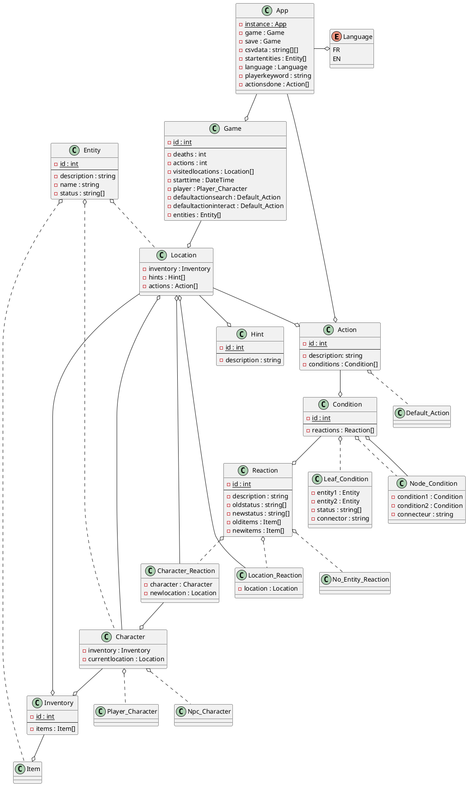

```plantuml
@startuml

Enum Language {
    FR
    EN
}

Class App {
    -{static} instance : App
    -game : Game
    -save : Game
    -csvdata : string[][]
    -startentities : Entity[]
    -language : Language
    -playerkeyword : string
    -actionsdone : Action[]
}

Class Entity {
    -{static} id : int
    --
    -description : string
    -name : string
    -status : string[]
}

Class Game {
    -{static} id : int
    --
    -deaths : int
    -actions : int
    -visitedlocations : Location[]
    -starttime : DateTime
    -player : Player_Character
    -defaultactionsearch : Default_Action
    -defaultactioninteract : Default_Action
    -entities : Entity[]
}

Class Reaction {
    -{static} id : int
    --
    -description : string
    -oldstatus : string[]
    -newstatus : string[]
    -olditems : Item[]
    -newitems : Item[]
}

Class Inventory {
    -{static} id : int
    --
    -items : Item[]
}

Class Action {
    -{static} id : int
  --
    -description: string
    -conditions : Condition[]
}

Class Default_Action {
}

Class Condition {
    -{static} id : int
    --
    -reactions : Reaction[]
}

Class Leaf_Condition {
    -entity1 : Entity
    -entity2 : Entity
    -status : string[]
    -connector : string
}

Class Node_Condition {
    -condition1 : Condition
    -condition2 : Condition
    -connecteur : string
}

Class Player_Character {}

Class Item {}

Class Location {
    -inventory : Inventory
    -hints : Hint[]
    -actions : Action[]
}

Class Location_Reaction {
    -location : Location
}

Class Character {
    -inventory : Inventory
    -currentlocation : Location
}

Class Character_Reaction {
    -character : Character
    -newlocation : Location
}

Class No_Entity_Reaction {}

Class Hint {
    -{static} id : int
  --
    -description : string
}

Class Npc_Character {}

Reaction o.. Character_Reaction
Action o.. Default_Action
Entity o.. Item
Entity o.. Location
Entity o.. Character
Condition o.. Leaf_Condition
Reaction o.. Location_Reaction
Reaction o.. No_Entity_Reaction
Condition o.down. Node_Condition
Character o.. Npc_Character
Character o.. Player_Character

App --o Game
/'App o-- Entity'/
App -o Language
App --o Action
Game --o Location
/'Game o-- Player_Character'/
/'Game o-up- Default_Action'/
/'Game o-right- Entity'/
Action --o Condition
/'Reaction o-- Item'/
Inventory --o Item
Condition --o Reaction
/'Leaf_Condition --o Entity'/
Node_Condition --o Condition
Location --o Inventory
Location --o Hint
Location --o Action
Location_Reaction --o Location
Character --o Inventory
Character --o Location
Character_Reaction --o Location
Character_Reaction --o Character


@enduml
```