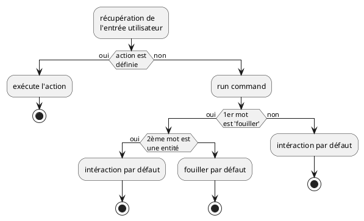

```plantuml
@startuml
:récupération de\nl'entrée utilisateur;
if (action est\ndéfinie) then (oui)
    :exécute l'action;
    stop
else (non)
    :run command;
    if (1er mot\nest 'fouiller') then (oui)
        if (2ème mot est\nune entité) then (oui)
            :intéraction par défaut;
            stop
        else
            :fouiller par défaut;
            stop
        endif
    else (non)
        :intéraction par défaut;
        stop
    endif
endif
@enduml
```