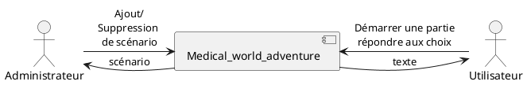
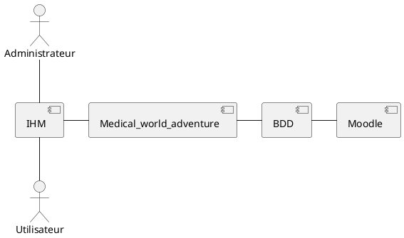
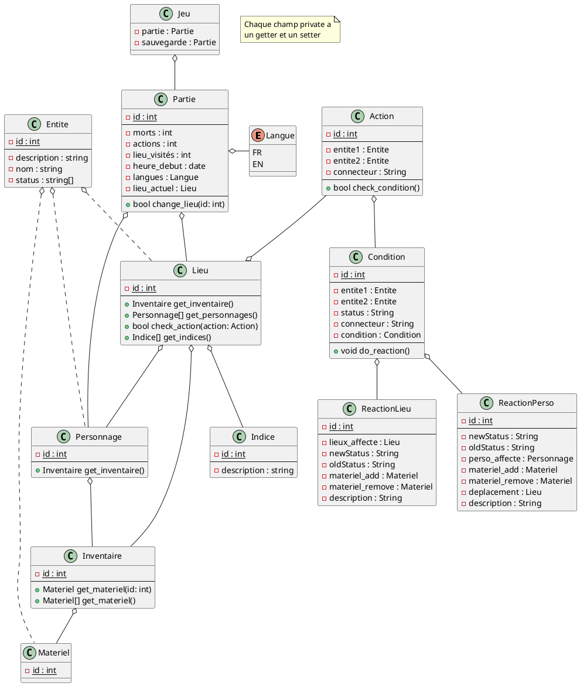

### Diagramme de Contexte

```plantuml 

@startuml Context-Diagram

Component Medical_world_adventure as Mwa
actor Utilisateur as util
actor Administrateur as admin


util -left-> Mwa : Démarrer une partie\nrépondre aux choix
util <-left- Mwa : texte

admin -right-> Mwa : Ajout/\nSuppression \nde scénario
admin <-right- Mwa : scénario

@enduml
```

### Vue logique

```plantuml
@startuml Logical-View
actor Utilisateur as util
actor Administrateur as admin

Component IHM
Component Medical_world_adventure as Mwa
Component BDD
Component Moodle

util -up- IHM
admin -down- IHM
Mwa -right- BDD
IHM -right- Mwa
BDD -right- Moodle

@enduml
```

### Model de donnée

```plantuml
@startuml

Enum Langue {
    FR
    EN
}

Class Jeu{
  -partie : Partie
  -sauvegarde : Partie
}
Class Entite{
    -{static} id : int
  --
    -description : string
    -nom : string
    -status : string[]
}

Class Partie{
    -{static} id : int
  --
    -morts : int
    -actions : int
    -lieu_visités : int
    -heure_debut : date
    -langues : Langue
    -lieu_actuel : Lieu
  --
    +bool change_lieu(id: int)
}

Class Inventaire{
    -{static} id : int
  --
    +Materiel get_materiel(id: int)
    +Materiel[] get_materiel()
}


Class Materiel{
    -{static} id : int
}

Class Personnage{
    -{static} id : int
  --
    +Inventaire get_inventaire()
}

Class Lieu{
    -{static} id : int
  --
    +Inventaire get_inventaire()
    +Personnage[] get_personnages()
    +bool check_action(action: Action)
    +Indice[] get_indices()
}

Class Action{
    -{static} id : int
  --
    -entite1 : Entite
    -entite2 : Entite
    -connecteur : String
  --
    +bool check_condition()
}

class Condition{
    -{static} id : int
  --
    -entite1 : Entite
    -entite2 : Entite
    -status : String
    -connecteur : String
    -condition : Condition
  --
    +void do_reaction()
}

Class ReactionLieu{
    -{static} id : int
  --
    -lieux_affecte : Lieu
    -newStatus : String
    -oldStatus : String
    -materiel_add : Materiel
    -materiel_remove : Materiel
    -description : String
}

Class ReactionPerso{
    -{static} id : int
  --
    -newStatus : String
    -oldStatus : String
    -perso_affecte : Personnage
    -materiel_add : Materiel
    -materiel_remove : Materiel
    -deplacement : Lieu
    -description : String
}


Class Indice{
    -{static} id : int
  --
    -description : string
}

note "Chaque champ private a\nun getter et un setter" as N1

Jeu o-- Partie
Personnage o-- Inventaire
Partie o-- Personnage
Partie o- Langue
Lieu o-- Inventaire
Lieu o-- Indice
Action o-- Condition
Condition o-- ReactionPerso
Condition o-- ReactionLieu
Action --o Lieu
Lieu o-- Personnage
Partie o-- Lieu
Inventaire o-- Materiel
Entite o.. Personnage
Entite o.. Lieu
Entite o.. Materiel

@enduml
```