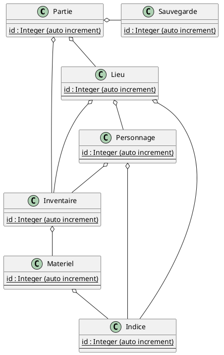

## Serious Game

### liste de fonctionalitées:
- charger un scénario
- lancer un scénario
- sauvegarder ca partie
- reprendre une partie sauvegardé
- présenter la situation actuelle
- connaitre son environement
- connaitre son inventaire
- intéragir textuellement
- éffectuer des déplacement
- éffectuer une actions
- reconnaitre des verbes prédéfinis
- obtenir un indice
- évaluer la réussite de la partie
- obtenir un score de réussite
- traduction

### liste des contraintes:
- sous forme d'extension moodle

### Diagramme de Contexte

### Vue logique

### Model de donnée

