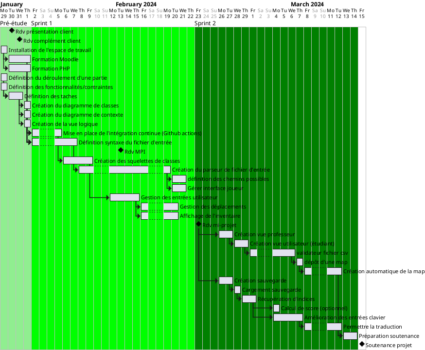
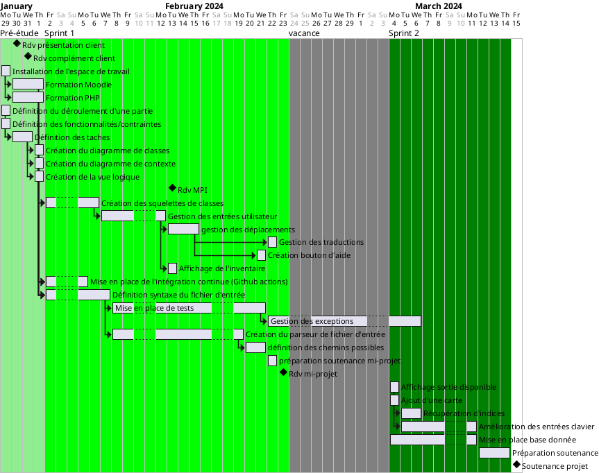

- <b>Planing previsionel</b> :

```plantuml

[Edit online] 	

@startgantt
Project starts the 29th of january 2024
saturday are closed
sunday are closed
hide footbox 

2024-01-29 to 2024-02-02 are named [Pré-étude]
2024-01-29 to 2024-02-02 are colored in lightgreen
2024-02-02 to 2024-02-23 are named [Sprint 1]
2024-02-02 to 2024-02-23 are colored in lime
2024-02-23 to 2024-03-14 are named [Sprint 2]
2024-02-23 to 2024-03-14 are colored in green

/' Pré-étude '/
[Rdv présentation client] happens the 30th of january 2024
[Rdv complément client] happens the 31st of january 2024
[Installation de l'espace de travail] requires 1 days
[Formation Moodle] requires 3 days
[Formation PHP] requires 3 days
[Installation de l'espace de travail] ->[Formation Moodle]
[Installation de l'espace de travail] ->[Formation PHP]
[Définition du déroulement d'une partie] requires 1 days
[Définition des fonctionnalités/contraintes] requires 1 days
[Définition des taches] requires 2 days
[Définition du déroulement d'une partie] -> [Définition des taches]
[Définition des fonctionnalités/contraintes] -> [Définition des taches]
[Création du diagramme de classes] requires 1 days
[Création du diagramme de contexte] requires 1 days
[Création de la vue logique] requires 1 days
[Définition des taches] -> [Création du diagramme de classes]
[Définition des taches] -> [Création du diagramme de contexte]
[Définition des taches] -> [Création de la vue logique]

/' sprint 1->2 '/
[Formation Moodle] -> [Mise en place de l'intégration continue (Github actions)]
[Formation PHP] -> [Mise en place de l'intégration continue (Github actions)]
[Création du diagramme de classes] -> [Mise en place de l'intégration continue (Github actions)]
[Création du diagramme de contexte] -> [Mise en place de l'intégration continue (Github actions)]
[Création de la vue logique] -> [Mise en place de l'intégration continue (Github actions)]
[Formation Moodle] -> [Définition syntaxe du fichier d'entrée]
[Formation PHP] -> [Définition syntaxe du fichier d'entrée]
[Création du diagramme de classes] -> [Définition syntaxe du fichier d'entrée]
[Création du diagramme de contexte] -> [Définition syntaxe du fichier d'entrée]
[Création de la vue logique] -> [Définition syntaxe du fichier d'entrée]

/' sprint 1 '/

[Rdv MPI] happens the 13rd of february 2024
[Mise en place de l'intégration continue (Github actions)] requires 2 days
[Création des squelettes de classes] requires 4 days
[Mise en place de l'intégration continue (Github actions)] -> [Création des squelettes de classes]
[Définition syntaxe du fichier d'entrée] requires 4 days
[Création du parseur de fichier d'entrée] requires 8 days
[Définition syntaxe du fichier d'entrée] -> [Création du parseur de fichier d'entrée]
[définition des chemins possibles] requires 2 days
[Création du parseur de fichier d'entrée] -> [définition des chemins possibles]
[Gérer interface joueur] requires 2 days
[Création du parseur de fichier d'entrée] -> [Gérer interface joueur]
[Gestion des entrées utilisateur] requires 4 days
[Création des squelettes de classes] -> [Gestion des entrées utilisateur]
[Gestion des déplacements] requires 3 days
[Gestion des entrées utilisateur] -> [Gestion des déplacements]
[Affichage de l'inventaire] requires 3 days
[Gestion des entrées utilisateur] -> [Affichage de l'inventaire]

[Rdv mi-projet] happens the 23rd of february 2024

[Création vue professeur] requires 2 days
[Création vue utilisateur (étudiant)] requires 2 days
[validateur fichier csv] requires 4 days
[dépôt d'une map] requires 1 days
[Création automatique de la map] requires 3 days
[Création sauvegarde] requires 2 days
[Cargement sauvegarde] requires 1 days
[Récupération d'indices] requires 2 days
[Calcul de score (optionnel)] requires 1 days
[Amélioration des entrées clavier] requires 4 days
[Permettre la traduction] requires 3 days
[Préparation soutenance] requires 2 days


[Rdv mi-projet] -> [Création vue professeur]
[Création vue professeur] -> [Création vue utilisateur (étudiant)]
[Création vue utilisateur (étudiant)] -> [validateur fichier csv] 
[validateur fichier csv] -> [dépôt d'une map]
[Rdv mi-projet] -> [Création sauvegarde]
[Création sauvegarde]-> [Cargement sauvegarde]
[Cargement sauvegarde] -> [Récupération d'indices]
[Récupération d'indices] -> [Calcul de score (optionnel)] 
[Récupération d'indices] -> [Amélioration des entrées clavier]
[dépôt d'une map] -> [Création automatique de la map] 
[Amélioration des entrées clavier] -> [Permettre la traduction]
[Création automatique de la map] -> [Préparation soutenance]
[Permettre la traduction] -> [Préparation soutenance]


[Soutenance projet] happens the 15th of march 2024

@endgantt

```

- <b>Planning effectif</b> :

```plantuml

[Edit online] 	

@startgantt
Project starts the 29th of january 2024
saturday are closed
sunday are closed
hide footbox 

2024-01-29 to 2024-02-02 are named [Pré-étude]
2024-01-29 to 2024-02-02 are colored in lightgreen
2024-02-02 to 2024-02-23 are named [Sprint 1]
2024-02-02 to 2024-02-23 are colored in lime
2024-02-24 to 2024-03-03 are named [vacance]
2024-02-24 to 2024-03-03 are colored in grey
2024-03-04 to 2024-03-14 are named [Sprint 2]
2024-03-04 to 2024-03-14 are colored in green

/' Pré-étude '/
[Rdv présentation client] happens the 30th of january 2024
[Rdv complément client] happens the 31st of january 2024
[Installation de l'espace de travail] requires 1 days
[Formation Moodle] requires 3 days
[Formation PHP] requires 3 days
[Définition du déroulement d'une partie] requires 1 days
[Définition des fonctionnalités/contraintes] requires 1 days
[Définition des taches] requires 2 days
[Création du diagramme de classes] requires 1 days
[Création du diagramme de contexte] requires 1 days
[Création de la vue logique] requires 1 days


[Définition du déroulement d'une partie] -> [Définition des taches]
[Définition des fonctionnalités/contraintes] -> [Définition des taches]
[Définition des taches] -> [Création du diagramme de classes]
[Définition des taches] -> [Création du diagramme de contexte]
[Définition des taches] -> [Création de la vue logique]
[Installation de l'espace de travail] ->[Formation Moodle]
[Installation de l'espace de travail] ->[Formation PHP]

[Rdv MPI] happens the 13rd of february 2024
[Création des squelettes de classes] requires 3 days
[Gestion des entrées utilisateur] requires 4 days
[gestion des déplacements] requires 3 days
[Gestion des traductions] starts 22rd of february 2024
[Création bouton d'aide] starts  21th of february 2024
[Affichage de l'inventaire] requires 1 days
[Mise en place de l'intégration continue (Github actions)] requires 2 days
[Définition syntaxe du fichier d'entrée] requires 4 days
[Mise en place de tests] requires 10 days
[Gestion des exceptions] requires 2 weeks
[Gestion des exceptions] starts 22rd of february 2024
[Création du parseur de fichier d'entrée] requires 8 days
[définition des chemins possibles] requires 2 days
[préparation soutenance mi-projet] requires 1 days
[préparation soutenance mi-projet] starts 22rd of february 2024
[Rdv mi-projet] happens the 23rd of february 2024


/' sprint 1->2 '/
[gestion des déplacements] -> [Création bouton d'aide]
[Création du diagramme de classes]->[Création des squelettes de classes]
[Formation Moodle] -> [Mise en place de l'intégration continue (Github actions)]
[Formation PHP] -> [Mise en place de l'intégration continue (Github actions)]
[Création du diagramme de classes] -> [Mise en place de l'intégration continue (Github actions)]
[Création du diagramme de contexte] -> [Mise en place de l'intégration continue (Github actions)]
[Création de la vue logique] -> [Mise en place de l'intégration continue (Github actions)]
[Formation Moodle] -> [Définition syntaxe du fichier d'entrée]
[Formation PHP] -> [Définition syntaxe du fichier d'entrée]
[Création du diagramme de classes] -> [Définition syntaxe du fichier d'entrée]
[Création du diagramme de contexte] -> [Définition syntaxe du fichier d'entrée]
[Création de la vue logique] -> [Définition syntaxe du fichier d'entrée]

/' sprint 1-2 '/

[Affichage sortie disponible] starts  4th of march 2024
[Affichage sortie disponible] requires 1 days
[Ajout d'une carte] starts  4th of march 2024
[Récupération d'indices] requires 2 days
[Amélioration des entrées clavier] requires 5 days
[Mise en place base donnée] starts  4th of march 2024
[Mise en place base donnée] requires 1 weeks and 1 days
[Préparation soutenance] starts  12th of march 2024
[Préparation soutenance] requires 3 days

[Mise en place de tests] -> [Gestion des exceptions]

[gestion des déplacements] -> [Gestion des traductions]
[Création de la vue logique] -> [Création des squelettes de classes]
[Définition syntaxe du fichier d'entrée] ->[Mise en place de tests]
[Définition syntaxe du fichier d'entrée] -> [Création du parseur de fichier d'entrée]
[Création du parseur de fichier d'entrée] -> [définition des chemins possibles]
[Création des squelettes de classes] -> [Gestion des entrées utilisateur]
[Gestion des entrées utilisateur] -> [gestion des déplacements]
[Gestion des entrées utilisateur] -> [Affichage de l'inventaire]

[Affichage sortie disponible] -> [Amélioration des entrées clavier] 
[Affichage sortie disponible] -> [Récupération d'indices] 


[Soutenance projet] happens the 15th of march 2024

@endgantt

```